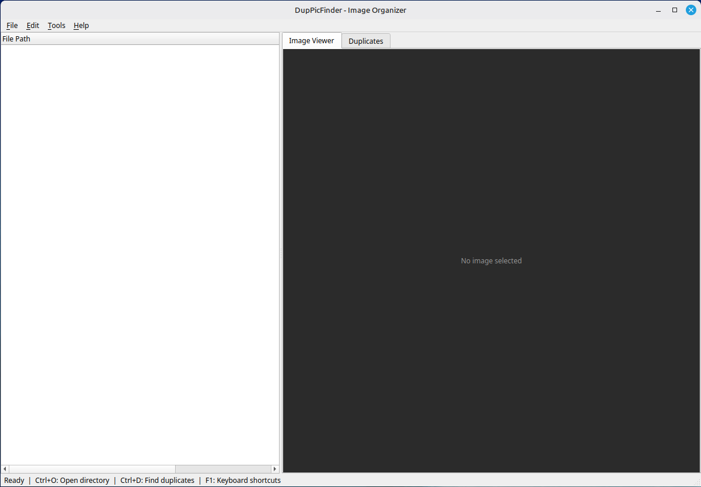
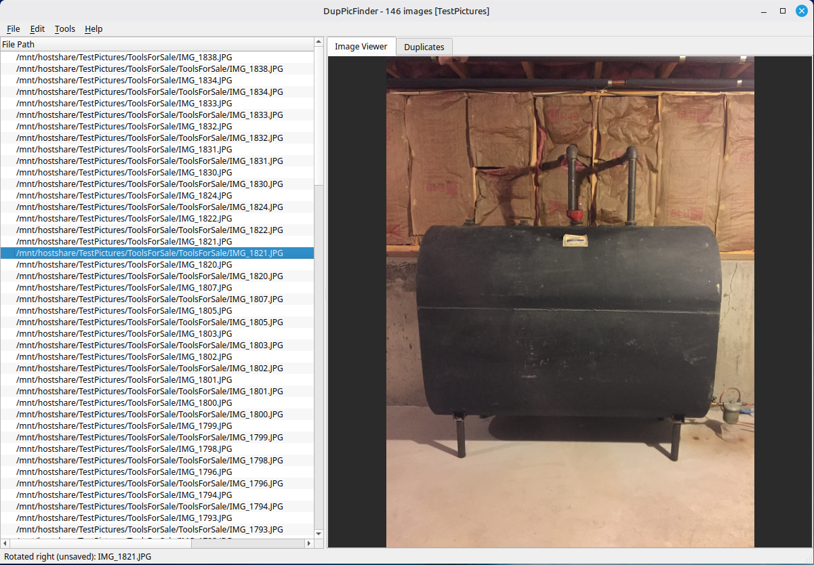
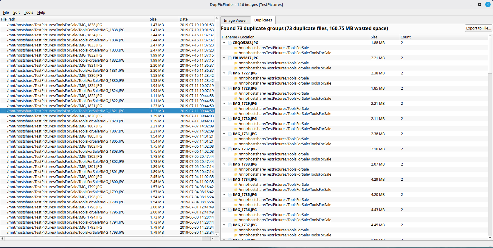

# Screenshots

## Initial Startup

The application on launch before a directory has been loaded.

---

## Image Viewer

Image selected from the file tree displayed in the Image Viewer tab.

---

## Duplicates View

The Duplicates tab after running **Tools → Find Duplicates**, showing the
tree structure with duplicate groups — filename at root level and folder
paths as children.
